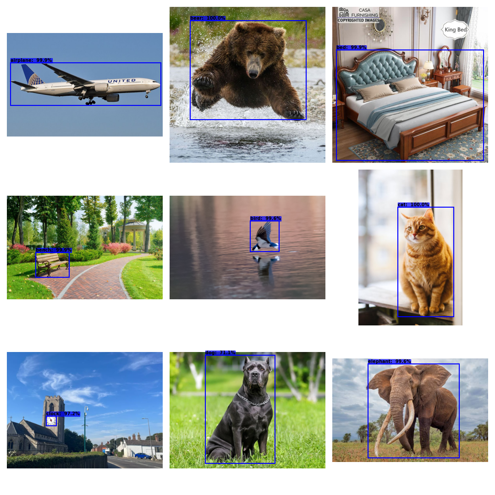
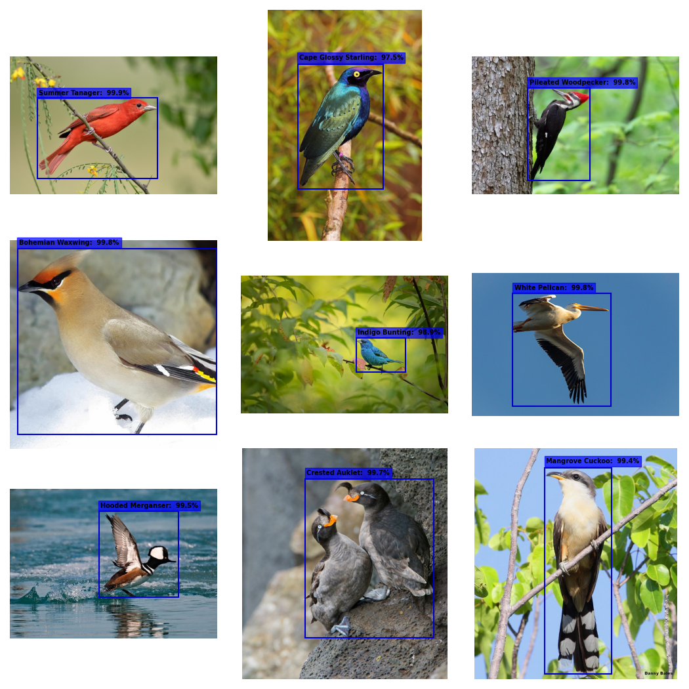
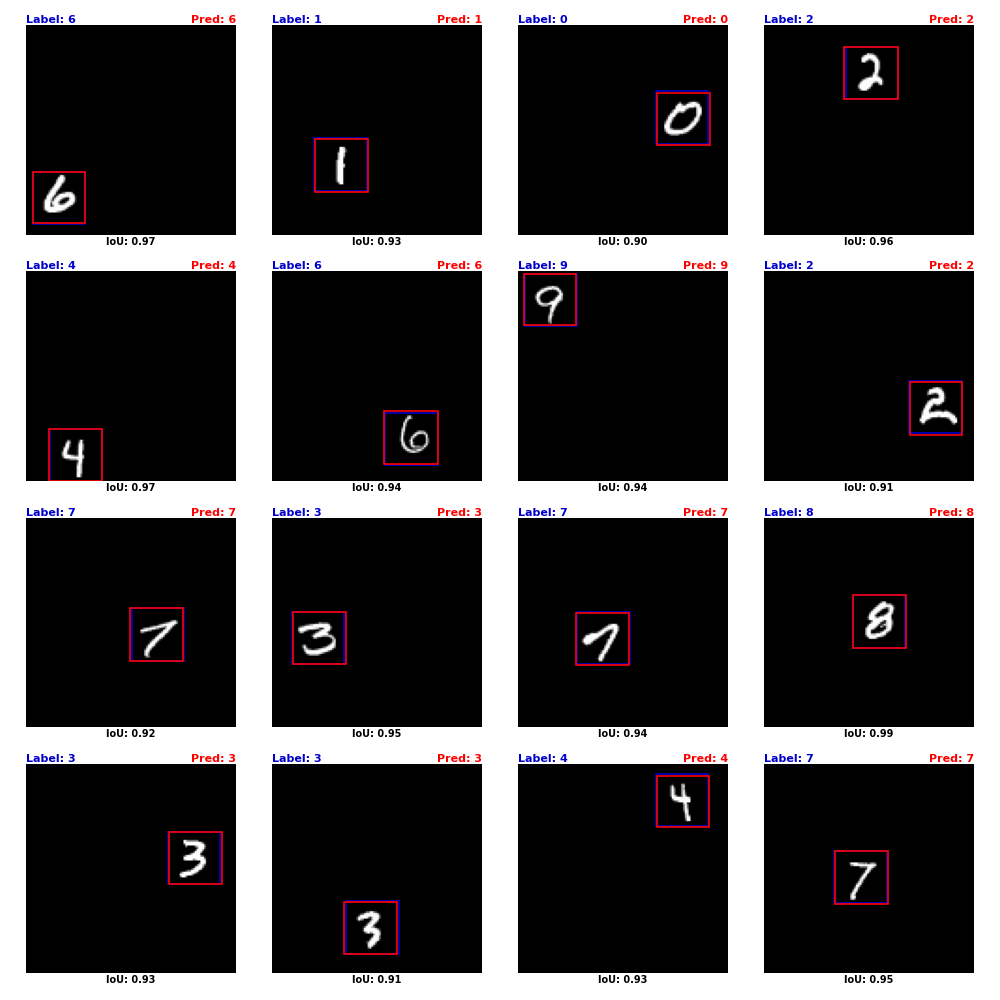

# <h1 align="center">**Object Detection**</h1>

 

This repository showcases the implementation of **Object Detection** models, a fundamental task in the field of **Computer Vision**. Object detection involves identifying and locating instances of objects such as cars, people, buildings, animals, etc., in static images or sequences of images (videos). These models provide bounding box coordinates along with class labels and confidence scores for each detected object.

Object detection has diverse applications, including **security and surveillance** (detecting intruders or unusual behavior), **industrial automation** (object tracking and quality control), **autonomous vehicles** (identifying pedestrians, traffic signs, and obstacles), **healthcare** (analyzing medical images for abnormalities), **precision agriculture** (monitoring crops and detecting pests), and **retail and commerce** (customer flow analysis and inventory management). 

Some of the models in this repository are built and trained from scratch using **Convolutional Neural Networks (CNNs)**. In other cases, **transfer learning** and/or **fine-tuning** are applied, leveraging pre-trained models on large datasets using frameworks like [TensorFlow](https://www.tensorflow.org/api_docs), [PyTorch](https://pytorch.org/docs/stable/index.html), and [Ultralytics](https://docs.ultralytics.com/). For basic models, tools like [TensorFlow Hub](https://www.tensorflow.org/hub) or the [timm](https://timm.fast.ai/) library are utilized. For advanced, real-time applications, cutting-edge models such as [YOLO11](https://docs.ultralytics.com/models/yolo11/) from Ultralytics are employed. Additionally, model training and fine-tuning leverage hardware resources such as **Google Colab TPUs** or **Google Colab GPUs**, depending on project requirements.

Most of the notebooks in this repository include **data augmentation techniques** applied to the training dataset to improve the model’s generalization capabilities. These techniques are implemented manually, using tools like [Albumentations](https://albumentations.ai/docs/), or automatically (e.g., with YOLO11). Strategies such as **callbacks** and **Learning Rate Schedulers** are also employed to prevent overfitting and achieve optimal performance.

If you're interested in exploring other Computer Vision tasks beyond Object Detection, you can visit my [repository](https://github.com/JersonGB22/ComputerVision).

## **Implemented Models:**

- **Object Detection with the [Pascal VOC 2012](http://host.robots.ox.ac.uk/pascal/VOC/voc2012/) Dataset:** The Pascal VOC 2012 dataset for object detection consists of 16,601 images across 20 object classes in realistic scenes, annotated with their respective bounding boxes. Each image may contain one or more instances of different classes. Of these, 13,299 images are used for training and 3,302 for validation. The **YOLO11l** model from **Ultralytics** was fine-tuned, achieving a **mAP50** of **0.823** and a **mAP50-95** of **0.681** on the validation dataset. 

- **Object Detection with the [VisDrone2019-DET](https://github.com/VisDrone/VisDrone-Dataset) Dataset:** The VisDrone2019-DET dataset consists of images captured by various cameras mounted on drones across 14 different cities in China. It is divided into 6,471 images for training, 548 for validation, and 1,610 for the test-dev set, featuring 10 distinct classes. Each image may contain one or more instances of multiple classes. The **YOLO11l** model from **Ultralytics** was fine-tuned, achieving a **mAP50** of **0.571** and a **mAP50-95** of **0.367** on the validation dataset. 

- **Fine-Grained Object Detection with the [Stanford Dogs](http://vision.stanford.edu/aditya86/ImageNetDogs/) Dataset:** The Stanford Dogs dataset consists of 20,580 images of 120 dog breeds from around the world, with 12,000 images for training and 8,500 for validation. Each image may contain one or more instances of a single class. The **YOLO11l** model from **Ultralytics** was fine-tuned for the fine-grained object detection task, achieving a **mAP50** of **0.855** and a **mAP50-95** of **0.785** on the validation dataset.

- **Oriented Object Detection with the [DIOR-R](https://gcheng-nwpu.github.io/#Datasets) Dataset:** The DIOR-R dataset contains 23,463 optical remote sensing images annotated with oriented bounding boxes. Each image may include one or more instances of various classes. The dataset is divided into 5,862 images for training, 5,863 for validation, and 11,738 for testing. The **YOLO11l** model from **Ultralytics** was fine-tuned for the oriented bounding box object detection task, achieving a **mAP50** of **0.84** and a **mAP50-95** of **0.678** on the validation dataset.  

- **Face Detection with the [WIDER FACE](https://shuoyang1213.me/WIDERFACE/) Dataset:** The WIDER FACE dataset consists of face images with various variations, divided into 12,880 training images and 3,226 validation images. Each image may contain one or multiple faces. The **YOLO11m** model from **Ultralytics** was fine-tuned, achieving a **mAP50** of **0.802** and a **mAP50-95** of **0.461** on the validation dataset. 

- **Object Detection with the [COCO](https://cocodataset.org/#home) Dataset:** A subset of the COCO dataset was extracted, consisting of 10,135 images across 18 object classes, each containing a single bounding box per image. This subset was split into 80% for training and 20% for validation. The **EfficientNetV2-S** model was fine-tuned, achieving an **accuracy** of **97.29%** and an **average IoU** of **0.856** on the validation dataset.  

- **Object Detection with the [Caltech-101](https://data.caltech.edu/records/mzrjq-6wc02) Dataset:** The Caltech-101 dataset comprises 8,677 images categorized into 101 object classes, where each image contains only one bounding box. Since the dataset lacks a predefined split, it was divided into 80% for training and 20% for testing. The **EfficientNetV2-S** model was fine-tuned, achieving an **accuracy** of **98.21%** and an **average IoU** of **0.879** on the test dataset.

- **Object Localization with the [CUB-200-2011](https://www.vision.caltech.edu/datasets/cub_200_2011/) Dataset:** The CUB-200-2011 dataset comprises 11,788 images of 200 bird species, each with a single bounding box. It is split into 5,994 images for training and 5,794 for testing. The **EfficientNetV2-S** model was fine-tuned for the object localization task, focusing on predicting only the bounding box coordinates, achieving an **average IoU** of **0.92** on the test dataset.

- **Simple Object Detection with the [MNIST](https://yann.lecun.com/exdb/mnist/) Dataset:** The MNIST dataset consists of grayscale images divided into 10 classes (digits 0-9), comprising 70,000 images: 60,000 for training and 10,000 for testing. Since the dataset does not include bounding boxes for the digits, an artificial variation was created. Each original 28x28 pixels image containing a digit was randomly placed on a black canvas of 112x112 pixels. A simple object detection model based on convolutional neural networks was then trained from scratch, achieving an **accuracy of** **99.3%** and an **average IoU** of **0.948** on the test dataset.

## **Some Results**

  <h2><b>VisDrone2019-DET Dataset</b></h2>
  

---

  <h2><b>Stanford Dogs Dataset</b></h2>
  

---

  <h2><b>Pascal VOC 2012 Dataset</b></h2>
  

---

  <h2><b>DIOR-R Dataset</b></h2>
  

---

  <h2><b>WIDER FACE Dataset</b></h2>
  

---

  <h2><b>COCO Dataset</b></h2>
  

---

  <h2><b>Caltech-101 Dataset</b></h2>
  

---

  <h2><b>CUB-200-2011 Dataset</b></h2>
  

---

  <h2><b>MNIST Dataset</b></h2>
  

#### *More results can be found in the respective notebooks.*

## **Technological Stack**
 

[![Ultralytics](https://img.shields.io/badge/Ultralytics-1572B6?style=for-the-badge&logo=data:image/svg+xml;base64,PHN2ZyB4bWxucz0iaHR0cDovL3d3dy53My5vcmcvMjAwMC9zdmciIGZpbGw9Im5vbmUiIHZpZXdCb3g9IjAgMCAyNTIgMjY0IiBoZWlnaHQ9IjI2NCIgd2lkdGg9IjI1MiI+CjxnIGNsaXAtcGF0aD0idXJsKCNjbGlwMF8xMDA4Xzk0MTc3KSI+CjxtYXNrIGhlaWdodD0iMjU4IiB3aWR0aD0iMjU0IiB5PSI2IiB4PSItMSIgbWFza1VuaXRzPSJ1c2VyU3BhY2VPblVzZSIgc3R5bGU9Im1hc2stdHlwZTpsdW1pbmFuY2UiIGlkPSJtYXNrMF8xMDA4Xzk0MTc3Ij4KPHBhdGggZmlsbD0id2hpdGUiIGQ9Ik0yNTIuMzkxIDYuMDY3ODFILTAuNDM3NVYyNjMuOTMySDI1Mi4zOTFWNi4wNjc4MVoiPjwvcGF0aD4KPC9tYXNrPgo8ZyBtYXNrPSJ1cmwoI21hc2swXzEwMDhfOTQxNzcpIj4KPHBhdGggZmlsbD0iIzBCMjNBOSIgZD0iTTU4Ljc1IDYuMDY4NTFDMjYuMTEzNiA2LjA2ODUxIC0wLjQzNzUgMzIuNjMxOCAtMC40Mzc1IDY1LjI4MjlDLTAuNDM3NSA5Ny45MzE0IDI2LjExMzYgMTI0LjQ5NiA1OC43NSAxMjQuNDk2QzkxLjM4NyAxMjQuNDk2IDExNy45MzggOTcuOTMxNCAxMTcuOTM4IDY1LjI4MjlDMTE3LjkzOCAzMi42MzE4IDkxLjM4NyA2LjA2ODUxIDU4Ljc1IDYuMDY4NTFaIj48L3BhdGg+CjxwYXRoIGZpbGw9IiMwQjIzQTkiIGQ9Ik0xMjUuNzE5IDE5MS40ODlDMTA0LjM5OSAxOTEuNDg5IDg0LjI1NDIgMTg2LjA4OCA2Ni41NzAzIDE3Ni42MDZWMjAzLjQ3MUM2Ni41NzAzIDIzNi4wNzEgOTIuNTg5OSAyNjMuMTIxIDEyNS4xNzUgMjYzLjQzNkMxNTguMDc4IDI2My43NTQgMTg0Ljk0NyAyMzcuMDY5IDE4NC45NDcgMjA0LjIyNlYxNzYuNTgxQzE2Ny4yNDcgMTg2LjA4NyAxNDcuMDY5IDE5MS40ODkgMTI1LjcxOSAxOTEuNDg5WiI+PC9wYXRoPgo8cGF0aCBmaWxsPSJ1cmwoI3BhaW50MF9saW5lYXJfMTAwOF85NDE3NykiIGQ9Ik0xMzMuNDY2IDY1LjI4OTVDMTMzLjQwNSAxMDYuNDgxIDk5Ljk3OTYgMTM5LjkzNCA1OC42NTg0IDE0MC4wMzVDNDIuNzE4NSAxNDAuMDc2IDI3Ljc2MDcgMTM1LjExMiAxNS41NTQ3IDEyNi40NDVDMzcuMTg4OCAxNjUuMTM0IDc4LjQ3MDEgMTkxLjUxNCAxMjUuNjczIDE5MS40MjNDMTk0LjI0MyAxOTEuNDc3IDI1MC44MjMgMTM1LjYyNiAyNTEuOTY2IDY3LjEyNTNMMjUxLjgwNCA2Ni45Nzg3QzI1MS44NzEgNjUuMjcxOSAyNTEuNzg4IDY2LjY3IDI1MS44NzEgNjUuMjcxOUMyNTEuOTA0IDMyLjU5OCAyMjUuMzEyIDUuOTMxMDEgMTkyLjgxNSA2LjA0NDc3QzE2MC4wMDggNi4xNzQzMiAxMzMuNDk5IDMyLjYxNTIgMTMzLjQ2NiA2NS4yODk1WiI+PC9wYXRoPgo8L2c+CjwvZz4KPGRlZnM+CjxsaW5lYXJHcmFkaWVudCBncmFkaWVudFVuaXRzPSJ1c2VyU3BhY2VPblVzZSIgeTI9IjI3LjA1MjciIHgyPSIyMTcuNzA4IiB5MT0iMTg5LjMyOCIgeDE9IjcxLjE1NTIiIGlkPSJwYWludDBfbGluZWFyXzEwMDhfOTQxNzciPgo8c3RvcCBzdG9wLWNvbG9yPSIjMDlEQkYwIj48L3N0b3A+CjxzdG9wIHN0b3AtY29sb3I9IiMwQjIzQTkiIG9mZnNldD0iMSI+PC9zdG9wPgo8L2xpbmVhckdyYWRpZW50Pgo8Y2xpcFBhdGggaWQ9ImNsaXAwXzEwMDhfOTQxNzciPgo8cmVjdCBmaWxsPSJ3aGl0ZSIgaGVpZ2h0PSIyNjQiIHdpZHRoPSIyNTIiPjwvcmVjdD4KPC9jbGlwUGF0aD4KPC9kZWZzPgo8L3N2Zz4K&logoColor=white&labelColor=101010)](https://docs.ultralytics.com/)

## **Contact**

